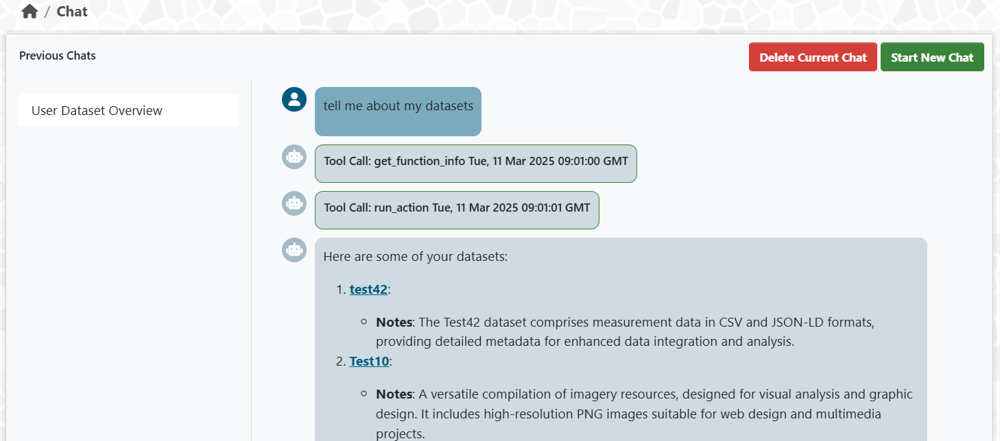

# ckanext-chat

[](https://github.com/Mat-O-Lab/ckanext-chat/actions/workflows/test.yml)

A CKAN plugin that adds an AI chat assistant powered by [pydantic-ai](https://ai.pydantic.dev/). The agent can execute CKAN actions with full user-aware authorization, search literature via vector RAG, and analyze documents. Chat histories are stored in browser local storage and passed as context to the agent.

The chat UI renders responses with marked.js and highlight.js. All CKAN operations respect the logged-in user's permissions.



## Architecture

```
User --> Chat UI (/chat)  --> front_agent / research_agent
                                  |
              +-------------------+-------------------+
              |                   |                   |
         ckan_run /          literature_search   literature_analyse
         mcp_call/mcp_tools       |                   |
              |                rag_agent           doc_agent
              v                   |                   |
      CKAN actions or         Milvus vector       Document text
      MCP JSON-RPC            store (RAG)         extraction
```

**Agents:**
- **front_agent** -- coordinates user requests, delegates to tools (max 3 tool calls)
- **research_agent** -- deep multi-source research with literature search + analysis (max 10 tool calls)
- **ckan_agent** -- validates and optimizes CKAN action calls (used as fallback when MCP unavailable)
- **rag_agent** -- vector search over Milvus for literature retrieval
- **doc_agent** -- targeted document section extraction and analysis

## ckanext-mcp Integration

When [ckanext-mcp](https://github.com/Mat-O-Lab/ckanext-mcp) is installed and loaded, the chat agent can call CKAN actions through its MCP endpoint instead of the internal `ckan_agent` intermediary.

**Why prefer MCP over the built-in ckan_agent path:**

- **No double-agent overhead.** The default path runs `front_agent -> ckan_agent -> run_action`, where ckan_agent is a separate LLM call that validates and optimizes the action. With MCP, the front_agent calls the MCP endpoint directly -- one LLM call instead of two, saving tokens and latency.
- **Better tool schemas.** ckanext-mcp generates full JSON Schema definitions for each CKAN action with typed parameters, enums, and defaults. The agent gets proper tool definitions rather than a free-text command string.
- **Smart defaults and pagination.** MCP applies intelligent parameter defaults and pagination hints at the server level, so the agent doesn't need to learn these patterns.
- **Consistent auth model.** MCP calls go through CKAN's standard HTTP auth pipeline with API tokens. The user's permissions are enforced the same way as any API call.
- **Tool discovery.** The agent can call `mcp_tools` to discover all available CKAN entity tools and their operations at runtime.

**How it works:**

The plugin detects whether `ckanext-mcp` is loaded at request time using `ckan.plugins.plugin_loaded('mcp')`. If available, it creates a per-user API token and sets up the MCP connection via JSON-RPC. The agent then has access to `mcp_tools` (discovery) and `mcp_call` (execution) tools alongside `ckan_run`.

If MCP is unavailable or the URL is not configured, the agent falls back to the `ckan_run -> ckan_agent` path transparently.

To enable, add `mcp` to `ckan.plugins`. The MCP URL is derived automatically from `ckan.site_url` + `/mcp` -- no extra configuration needed.

## OpenAI-Compatible Chat Completions API

The plugin exposes an endpoint compatible with the
[OpenAI Chat Completions API](https://platform.openai.com/docs/api-reference/chat/create).
Any client that speaks this protocol can use it --
the `openai` Python/JS SDKs, `curl`, LangChain, etc.

### Endpoint

```
POST /chat/v1/chat/completions
```

Located on the same CKAN host, e.g.
`https://your-ckan.org/chat/v1/chat/completions`.

### Authentication

CKAN API token in the `Authorization: Bearer <token>` header.
Generate one in the CKAN UI under *User > API Tokens*.

### Compatibility

| Feature | Supported |
|---------|-----------|
| `messages` array (user/assistant/system roles) | yes |
| `stream: false` (default) | yes |
| `stream: true` (SSE) | yes |
| `model` selection | `"default"` or `"research"` |
| `temperature`, `top_p`, `max_tokens` | ignored (agent manages these) |
| `tools` / `functions` | not applicable (agent has its own tools) |
| `n` > 1 (multiple choices) | no |
| Usage stats in response | yes (`prompt_tokens`, `completion_tokens`) |

Streaming follows the SSE format with `chat.completion.chunk` objects
and terminates with `data: [DONE]`.

### Examples

**curl (non-streaming):**
```bash
curl -X POST https://your-ckan.org/chat/v1/chat/completions \
  -H "Authorization: Bearer YOUR_CKAN_API_TOKEN" \
  -H "Content-Type: application/json" \
  -d '{
    "messages": [
      {"role": "user", "content": "What datasets are available?"}
    ]
  }'
```

**curl (streaming):**
```bash
curl -N -X POST https://your-ckan.org/chat/v1/chat/completions \
  -H "Authorization: Bearer YOUR_CKAN_API_TOKEN" \
  -H "Content-Type: application/json" \
  -d '{
    "messages": [
      {"role": "user", "content": "Search for climate data"}
    ],
    "stream": true
  }'
```

**Python (openai SDK):**
```python
from openai import OpenAI

client = OpenAI(
    base_url="https://your-ckan.org/chat/v1",
    api_key="YOUR_CKAN_API_TOKEN",
)

response = client.chat.completions.create(
    model="default",
    messages=[
        {"role": "user", "content": "List all datasets"}
    ],
)
print(response.choices[0].message.content)
```

Set `model` to `"research"` to use the research agent
(deeper multi-source analysis, up to 10 tool calls)
instead of the default front agent (quick answers, up to 3 tool calls).

## LLM Compatibility

OpenAI models from gpt-4o-mini onward work well. Local LLMs tested with ollama:

| LLM | Compatible? |
|-----|-------------|
| qwen2.5:32b | works, some odd output |
| llama3.3:70B | works, reluctant to call tools |
| gemma3 | no tool support |
| phi4 | no tool support |
| qwq | too much reasoning, not enough action |
| mistral:7B | poor tool integration via OpenAI interface |

Reasoning models generally don't perform well -- tool calling needs fast, decisive models.

## Requirements

Compatibility with CKAN versions:

| CKAN version | Compatible? |
|--------------|-------------|
| 2.9 and earlier | not tested |
| 2.10 | yes |
| 2.11 | yes |

## Installation

1. Activate your CKAN virtual environment:
```bash
. /usr/lib/ckan/default/bin/activate
```

2. Install the package:
```bash
pip install ckanext-chat
```

3. Add `chat` to `ckan.plugins` in your CKAN config.

4. Restart CKAN.

## Config Settings

### Model provider (required)

**Azure OpenAI** (default):
```bash
CKANINI__CKANEXT__CHAT__PROVIDER="azure"
CKANINI__CKANEXT__CHAT__BASE_URL="https://your-subscription.openai.azure.com/"
CKANINI__CKANEXT__CHAT__API_KEY="your-api-key"
CKANINI__CKANEXT__CHAT__MODEL_NAME="gpt-4o-mini"
CKANINI__CKANEXT__CHAT__API_VERSION="2024-06-01"
```

**OpenAI-compatible endpoint** (ollama, vLLM, LiteLLM, etc.):
```bash
CKANINI__CKANEXT__CHAT__PROVIDER="openai"
CKANINI__CKANEXT__CHAT__BASE_URL="http://localhost:11434/v1"
CKANINI__CKANEXT__CHAT__API_KEY="ollama"
CKANINI__CKANEXT__CHAT__MODEL_NAME="qwen2.5:32b"
```

**Backward compatibility:** The old config keys (`completion_url`, `api_token`, `deployment`) still work. New keys take precedence when set.

### Optional: thinking model

For the research agent, you can configure a separate model optimized for reasoning:
```bash
CKANINI__CKANEXT__CHAT__THINK_MODEL_NAME="gpt-4.1-mini"
```

Falls back to `model_name` if not set.

### Optional: Milvus RAG

```bash
CKANINI__CKANEXT__CHAT__MILVUS_URL="http://milvus:19530"
CKANINI__CKANEXT__CHAT__COLLECTION_NAME="documents"
CKANINI__CKANEXT__CHAT__EMBEDDING_MODEL="text-embedding-3-small"
CKANINI__CKANEXT__CHAT__EMBEDDING_API="https://your-embedding-api"
```

Without these, the literature search agent relies on `package_search`.

### All config keys

| Key | Default | Description |
|-----|---------|-------------|
| `ckanext.chat.provider` | `azure` | `azure` or `openai` |
| `ckanext.chat.base_url` | | Model provider endpoint URL |
| `ckanext.chat.api_key` | | API key for the model provider |
| `ckanext.chat.model_name` | `gpt-4o-mini` | Model for front_agent, ckan_agent, rag_agent, doc_agent |
| `ckanext.chat.think_model_name` | | Model for research_agent (falls back to model_name) |
| `ckanext.chat.api_version` | `2024-06-01` | Azure API version |
| `ckanext.chat.milvus_url` | | Milvus vector store URL |
| `ckanext.chat.collection_name` | | Milvus collection name |
| `ckanext.chat.embedding_model` | `text-embedding-3-small` | Embedding model name |
| `ckanext.chat.embedding_api` | | Embedding API endpoint |
| `ckanext.chat.ssl_verify` | `true` | Verify SSL certificates for resource downloads |
| `ckanext.chat.completion_url` | | (legacy) Azure endpoint, use `base_url` instead |
| `ckanext.chat.api_token` | | (legacy) API key, use `api_key` instead |
| `ckanext.chat.deployment` | `gpt-4o-mini` | (legacy) Model name, use `model_name` instead |

## Timeouts

Proxy in front of CKAN must allow long-running API calls. For nginx:
```conf
proxy_connect_timeout 3600s;
proxy_read_timeout 3600s;
proxy_send_timeout 3000s;
send_timeout 3000;
```

For production with uWSGI, set harakiri in `start_ckan.sh`:
```bash
UWSGI_OPTS="--socket /tmp/uwsgi.sock \
            --wsgi-file /srv/app/wsgi.py \
            --module wsgi:application \
            --http 0.0.0.0:5000 \
            --master --enable-threads \
            --lazy-apps \
            -p 2 -L -b 32768 --vacuum \
            --harakiri-verbose \
            --socket-timeout $UWSGI_HARAKIRI \
            --harakiri $UWSGI_HARAKIRI \
            --http-timeout $UWSGI_HARAKIRI"
```
```bash
UWSGI_HARAKIRI="3000"
```

## Developer Installation

```bash
git clone https://github.com/Mat-O-Lab/ckanext-chat.git
cd ckanext-chat
pip install -e ".[dev]"
```

## Tests

```bash
pytest --ckan-ini=test.ini
```

## License

[AGPL](https://www.gnu.org/licenses/agpl-3.0.en.html)
