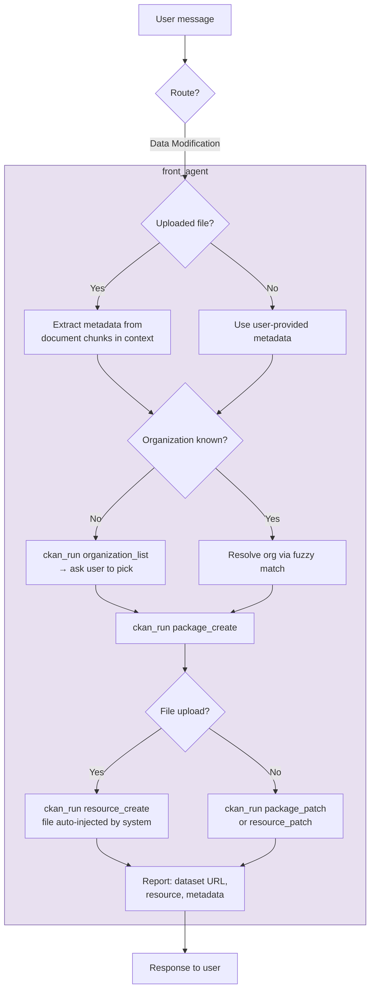

# Front Agent — Execution Workflow (Route C)

User wants to create, update, upload, or modify data.

```mermaid
flowchart TD
    A[User message] --> B{Route?}
    B -->|Data Modification| C

    subgraph front["front_agent"]
        C{Uploaded file?}
        C -->|Yes| D[Extract metadata from<br>document chunks in context]
        C -->|No| E[Use user-provided metadata]

        D --> F{Organization known?}
        E --> F

        F -->|No| G[ckan_run organization_list<br>→ ask user to pick]
        F -->|Yes| H[Resolve org via fuzzy match]

        G --> I[ckan_run package_create]
        H --> I

        I --> J{File upload?}
        J -->|Yes| K[ckan_run resource_create<br>file auto-injected by system]
        J -->|No| L[ckan_run package_patch<br>or resource_patch]

        K --> M[Report: dataset URL,<br>resource, metadata]
        L --> M
    end

    M --> Z[Response to user]

    style front fill:#e8e0f0,stroke:#7b5ea7
```

**Key rules:** Execute immediately, no confirmation. Max 1 question to user (org + visibility).
