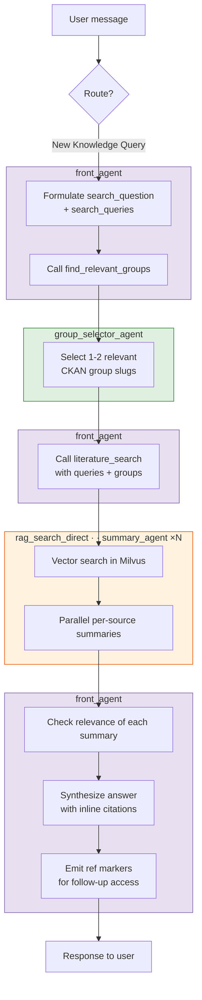

# Front Agent — Search Workflow (Route B)

User asks a new knowledge question not referencing prior results.

```mermaid
flowchart TD
    A[User message] --> B{Route?}
    B -->|New Knowledge Query| C

    subgraph front["front_agent"]
        C[Formulate search_question<br>+ search_queries]
        C --> D[Call find_relevant_groups]
    end

    D --> GS

    subgraph group["group_selector_agent"]
        GS[Select 1-2 relevant<br>CKAN group slugs]
    end

    GS --> E

    subgraph front2["front_agent"]
        E[Call literature_search<br>with queries + groups]
    end

    E --> RAG

    subgraph rag["rag_search_direct  · ·  summary_agent ×N"]
        RAG[Vector search in Milvus]
        RAG --> SUM[Parallel per-source summaries]
    end

    SUM --> F

    subgraph front3["front_agent"]
        F[Check relevance of each summary]
        F --> G[Synthesize answer<br>with inline citations]
        G --> H[Emit ref markers<br>for follow-up access]
    end

    H --> Z[Response to user]

    style front fill:#e8e0f0,stroke:#7b5ea7
    style front2 fill:#e8e0f0,stroke:#7b5ea7
    style front3 fill:#e8e0f0,stroke:#7b5ea7
    style group fill:#e0f0e0,stroke:#2e7d32
    style rag fill:#fff3e0,stroke:#e65100
```

**Tool budget:** max 2–3 calls (`find_relevant_groups` + `literature_search` → answer)
